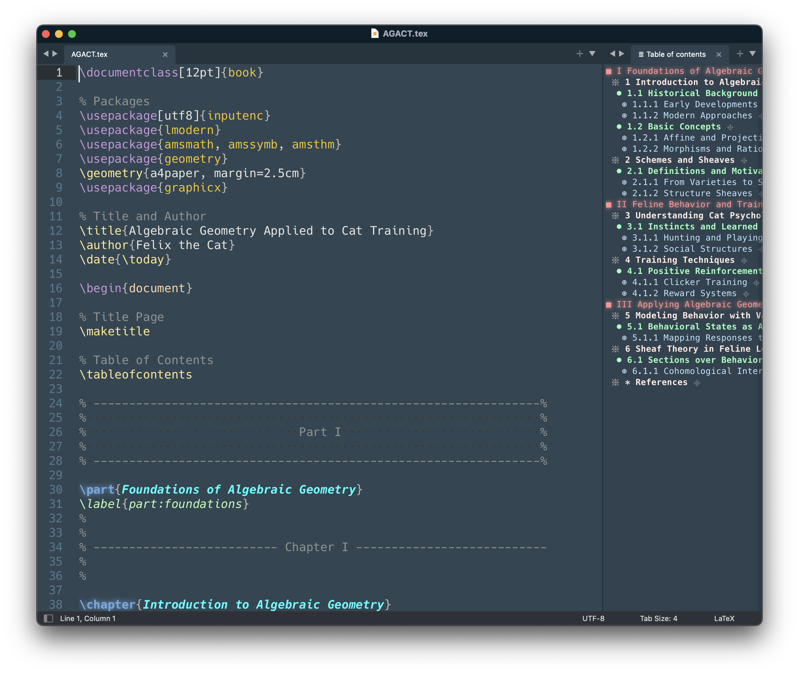

## LaTeXOutline for Sublime Text

### Overview

LaTeXOutline is an ST4 package which allows displaying a clickable table of contents for a LaTeX file. This outline is shown on a separate tab.

LaTeXOutline is intended to be used with the `article`, `book` and `beamer` LaTeX classes.
In particular, the captured sectioning commands are: `part`, `chapter`, `section`, `subsection`, `subsubsection`, `subsubsubsection`, `paragraph` and `frametitle`.

It only works with *single-file* LaTeX documents.

#### Manual installation

1. Clone or download this repository using the green `Clone or download` button.
2. If needed, rename the cloned or extracted folder to `LaTeXOutline`. 
3. Move the `LaTeXOutline` folder to your Sublime Text's `Packages` folder. 
4. Restart Sublime Text.
5. Modify the settings, the keybindings and possibly the `LaTeXOutline-custom.hidden-color-scheme` to your liking by going to the menu `Settings` > `Packages Settings`  > `LaTeXOutline` or by using the corresponding Command Palette entries.

### Usage

1. Open a LaTeX File.

2. Use the command Palette entries `LaTeXOutline: ToC on the Right` (or `Left`), `LaTeXOutline: ToC and labels on the Right` (or `Left`) to open the outline pane. Use `LaTeX Outline: Close sidebar` to close it.

   Alternatively, use the corresponding shortcuts (`super j, a`, `super j, e`, `super j, z` by default, where `super` is `ctrl` on windows/linux and `⌘` on mac). See the keybindings settings for more details.

3. Click on the titles in the LaTeXOutline tab to get to the corresponding place in your LaTeX file.

   Click on a `⌖` sign to take a look at a part of the LaTeX file without moving the caret. Use the standard Sublime Text keybinding `super K, super C` to go back to the original place.

   Click on a `❐` sign to copy the corresponding label to the clipboard.

   Click on a section's *bullet* in the LaTeXOutline tab to copy the section's corresponding label in the clipboard. A message is given in the status bar below to indicate if this label has been found.

### License

This plugin is licensed under the MIT license. In particular, it is provided "as is", without warranty of any kind!

### Acknowledgements

LaTeXOutline is originally a specific adaptation of warmdev's original [SublimeOutline](https://github.com/warmdev/SublimeOutline) to LaTeX files, using modifications due to vlad-wonderkidstudio, see [SublimeOutline](https://github.com/vlad-wonderkidstudio/SublimeOutline). It still uses a significant part of this code.
